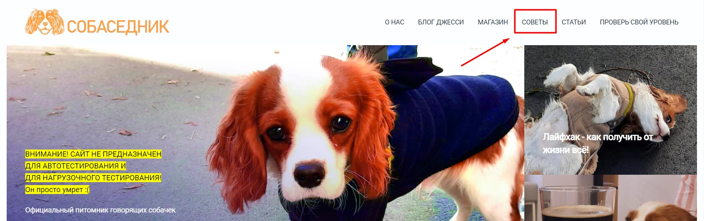

[⬅️ вернуться к тестовой документации](https://github.com/denjervu/qa-portfolio/tree/main/test-doc)

# Ссылка Советы в шапке сайта не работает

## Идентификатор
HEA-001

## Краткое описание
Ссылка "Советы" в шапке сайта не работает.

## Описание
Ссылка "Советы" в шапке сайта не работает. Такое поведение наблюдается при попытке перехода с разных страниц сайта.

## Статус баг-репорта
Открыт

## Связанное требование

[ссылка на сайт](https://guru.qahacking.ru/)
Здесь могла бы быть ссылка на требование, но в этом учебном проекте нет требований

## Предусловия
Предусловий нет.

## Шаги для воспроизведения

1. Перейти по ссылке "Советы" в шапке сайта

## Ожидаемый результат

Ссылка "Советы" в шапке сайта ведет на страницу "Советы".

## Фактический результат

Ссылка "Советы" в шапке сайта не работает - при нажатии на ссылку ничего не происходит.

## Критичность
- [ ] Критическая
- [ ] Высокая
- [x] средняя
- [ ] низкая

## Приоритет
- [ ] Высокий
- [x] Средний 
- [ ] Низкий

## Воспроизводимость
- [x] всегда 
- [ ] иногда

## Симптом 
- [ ] Косметический дефект
- [ ] Повреждение/потеря данных
- [x] Некорректная операция
- [ ] Ошибка локализации
- [x] Нереализованная функциональность
- [ ] Неожиданное поведение
- [ ] Недружественное поведение

## Возможность обойти 
- [ ] Да 
- [x] Нет

## Окружение
Windows 10 v22H2 
Google Chrome v125.0.6422.142

## Комментарии
Прикладываю блок кода из DevTools, связанный с этой ссылкой. Предполагаю, что в атрибут href не была добавлена требуемая ссылка на страницу "Советы".

```
<li>
	<a href="#">
		"Советы"
	</a>
</li>
```

## Вложения 


## Ссылки на связанные артефакты
Отсутствуют

## Автор отчета
Жеребцов Денис
